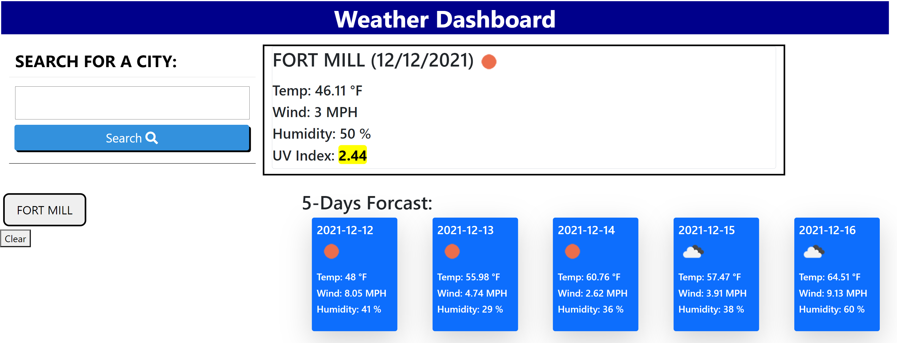

# Weather-Dashboard
## Description
For this week challenge, we were to create a weather dashboard using third-party APIs. We used openweather onecall API for the weather data for cities. 




### What It should do
The weather Dashborder will give the user the current weather condition of the city that they entered. It will display the temperature, the humidity, the wind speed and the uv index. It will also display the 5 day forcast of the selected city with the temperature, the humidity, and the wind speed. The user can also view the previous cities that they enter in the history list again.
### Problem I had..
I had some problem connented to the weather API. I was giving a error code 401. In the JavaScript, I had the API key in a variable. It was not reading the it.
```html
var APIkey ='4e460ef796224efaf5dab593e57a5787';
```
to fix this I inserted the API key directly in the API call and this fix the problem 
```html
'https://api.openweathermap.org/data/2.5/weather?q='+ list +'&units=imperial&appid=4e460ef796224efaf5dab593e57a5787';
``` 
## User Story
```
AS A traveler
I WANT to see the weather outlook for multiple cities
SO THAT I can plan a trip accordingly
```
## Acceptance Criteria
```
GIVEN a weather dashboard with form inputs
WHEN I search for a city
THEN I am presented with current and future conditions for that city and that city is added to the search history
WHEN I view current weather conditions for that city
THEN I am presented with the city name, the date, an icon representation of weather conditions, the temperature, the humidity, the wind speed, and the UV index
WHEN I view the UV index
THEN I am presented with a color that indicates whether the conditions are favorable, moderate, or severe
WHEN I view future weather conditions for that city
THEN I am presented with a 5-day forecast that displays the date, an icon representation of weather conditions, the temperature, the wind speed, and the humidity
WHEN I click on a city in the search history
THEN I am again presented with current and future conditions for that city
```